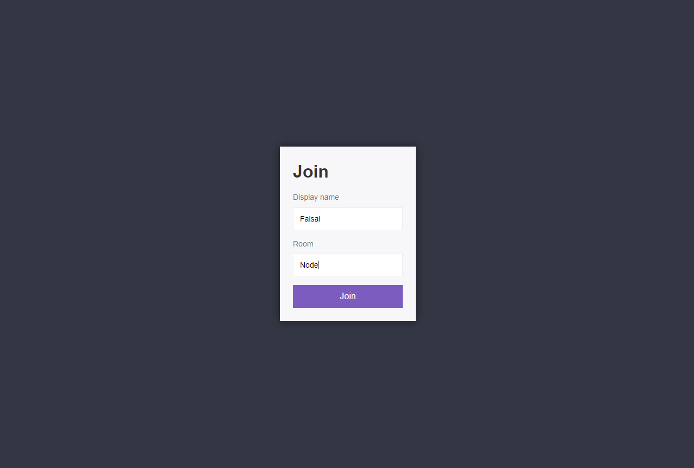
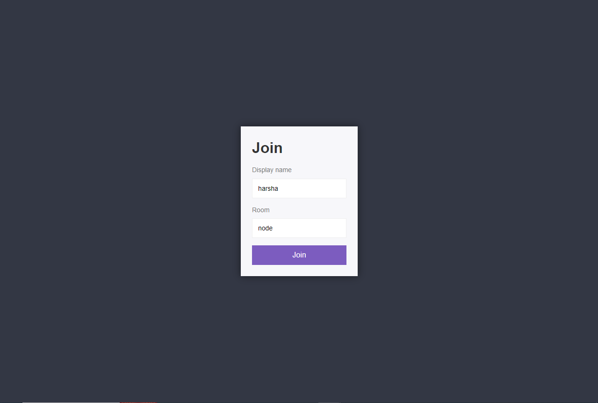
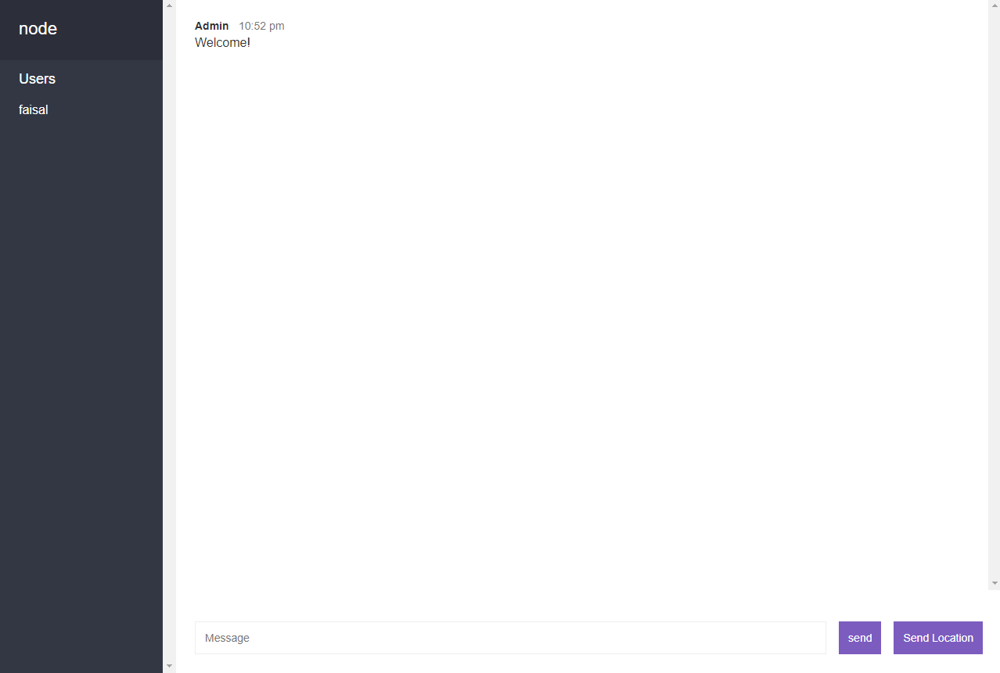
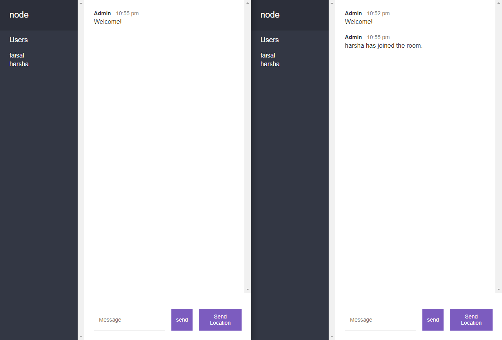
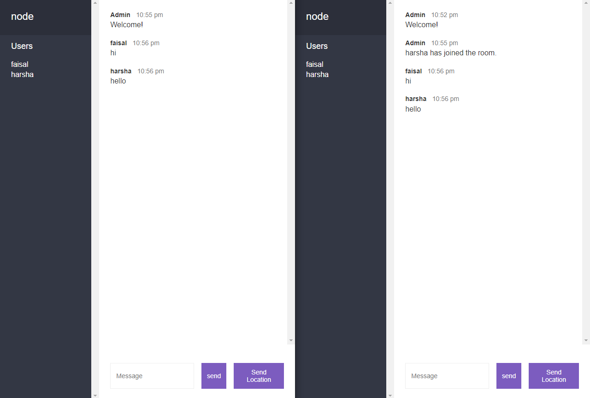

# Chat Application

This project is built on Node.js and socket.io. Users can communicate with each other in a room and create their own rooms to invite friends for chatting.

Share the live site URL with your friends and enjoy chatting together.

## Table of Contents

- [Overview](#overview)
  - [The Problem](#the-problem)
  - [Screenshots](#screenshots)
  - [Links](#links)
- [My Process](#my-process)
  - [Built With](#built-with)
  - [What I Learned](#what-i-learned)
  - [Continued Development](#continued-development)
  - [Useful Resources](#useful-resources)
- [Author](#author)

## Overview

### The Problem

The goal of this project is to create a real-time chat application where users can join rooms, chat with each other, and have a seamless chatting experience.

### Screenshots

#### Join Page 

#### Room Page

#### User Connected Page

#### Chatting

### Links

- <a href="https://chat-app-1yjb.onrender.com/" target="_blank">Live Site URL</a>

## My Process

### Built With

- Node.js
- Socket.io
- Semantic HTML5 markup
- CSS custom properties

### What I Learned

Through this project, I gained insights into building real-time applications using technologies like Node.js and socket.io. I learned how to handle real-time communication between multiple clients and how to create a seamless chatting experience for users.

### Continued Development

#### 1. Advanced Node.js

I aim to deepen my understanding of advanced Node.js concepts to improve the performance and scalability of my applications. This includes learning about event-driven architecture, asynchronous programming patterns, and best practices for handling large-scale applications.

#### 2. Enhanced UI/UX

To create a more engaging and user-friendly chat application, I plan to focus on enhancing the UI/UX design. This involves exploring modern design principles, implementing responsive layouts, and adding interactive features to improve the overall user experience.

#### 3. Security Measures

As security is crucial for any web application, I intend to learn more about implementing security measures in Node.js applications. This includes securing communication channels, protecting against common vulnerabilities, and implementing authentication and authorization mechanisms to ensure data privacy and integrity.

### Useful Resources

- [Socket.io](https://socket.io/) - This library helped me understand the concept of real-time communication and implement it effectively in my project.
- [OpenCageData](https://opencagedata.com/) - This resource was helpful in identifying the geo-location of an address.

## Author

- Twitter - [@Faisal_DevLife](https://twitter.com/Faisal_DevLife)
- LeetCode - [@faisalkhanisrar](https://leetcode.com/faisalkhanisrar/)

Feel free to provide feedback and suggestions to make this readme more incredible.
